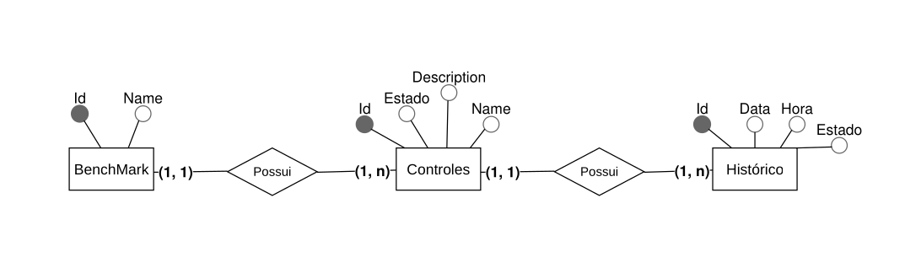

# Proposta:
    "Desenhe o modelo conceitual (MER) e diga quais índices básicos criaria (e por quê).
    Sem DDL."
# Mini-Mundo:
    "Benchmark (id, name) tem vários Controles.
    Controle (id, name, description) pertence a um Benchmark
    e possui um estado (ok | alarm).
    Deve ser possível registrar mudanças de estado para reconstruir o histórico."
# Cenários:
    (Q1) Listar Benchmark com seus Controles e o estado atual.
    (Q2) Listar Benchmark com seus Controles e as mudanças de estado em um intervalo.
    (Q3) Obter Benchmark com seus Controles e o estado em uma data/hora X.

# Diagrama MER:

# Índices
* ### Índice de ordem decrescente na coluna "Data" da tabela Histórico (Q2 e Q3)
    Com um índice de ordem decrescente na coluna de data, o banco de dados poderá acessar com muito mais velocidade os estados, tanto em um intervalo — pois as datas consecutivas ficarão próximas umas das outras — quanto em uma data/hora específica, já que ele saberá, dentro de suas tabelas de índice, em qual "ordem de grandeza" procurar e, portanto, encontrará o grupo da data de forma mais assertiva.
* ### Índice (ok/alarm) de Estado na coluna "Estado" do controles (Q1)
    Facilitará significativamente o monitoramento, pois será mais rápido verificar quais parâmetros estão fora do padrão, para fins de correção ou avaliação. 
* ### Índice de ordem alfabética nos Controles na coluna "Nome"(Q1,Q2,Q3)
    Ajudará caso o cliente deseje consultar um controle específico, permitindo obter seus dados de maneira mais rápida.Também acelerará processos de ordenação e exibição.
