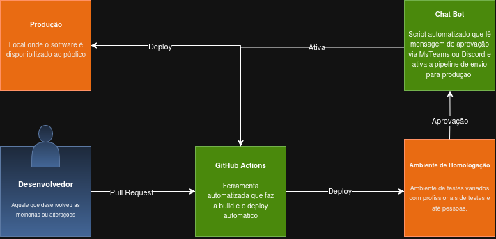

# Questão 3
### As propostas Problema > Causa > Solução estão organizadas em primeiro, segundo, terceiro e quarto itens de forma respectiva entre si, ou seja, o primeiro problema tem a primeira causa e assim por diante..

# Cenário:
    "Uma empresa possui um software com Node.js (backend) e React (frontend).
     Atualmente, a cada nova versão, o cliente empacota os componentes manualmente 
     e realiza o deploy em homologação. Após uma semana, repete o processo para produção."

# Problemas:
* ### Esquecer de empacotar alguma **dependência** como bibliotecas, códigos importados ou frameworks.
* ### Processos repetitivos, cansativos e **dependência** de anotações do desenvolvedor.
* ### Fase de homologação **suscetível** a erros humanos.
* ### Redundância de processos.

# Causas:
* ### Todos os requisitos e bibliotecas têm que ser prescritos e empacotados manualmente.
* ### Excesso de códigos, tanto em variedade quanto em quantidade.
* ### Todas as funcionalidades precisam ser repetidamente testadas na homologação a cada deploy.
* ### Repete-se o mesmo processo cansativo para duas **fases** (homologação e produção).

# Soluções:
* ### Uso de libs ou ferramentas como **npm** ou **yarn** para empacotar e organizar os requisitos de maneira automática e organizada. 
* ### Automação com ativação por commit usando **GitHub Actions** para execução **autônoma do deploy**.
* ### Uso de testes automatizados antes do ambiente de homologação.
* ### Após o deploy em homologação, integrar com **chatbot (MS Teams ou Discord)** para solicitar aprovação e liberar automaticamente para produção.

     

